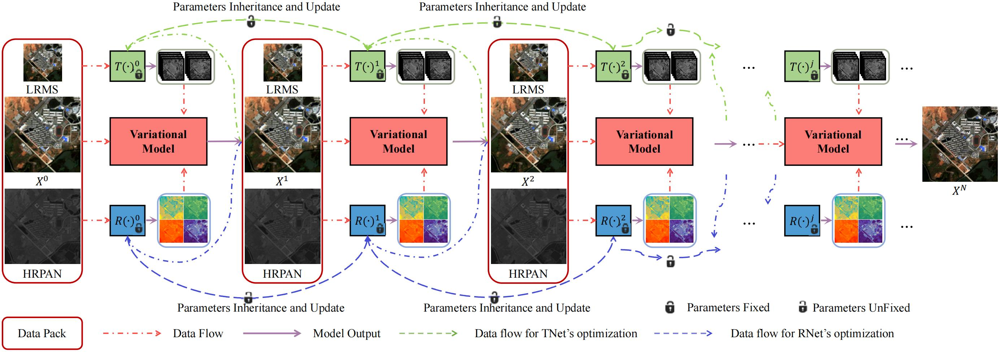

# Implement of ZeroSharpen

Code for Zero-Sharpen: A universal pansharpening method across satellites for reducing scale-variance gap via zero-shot variation


###### Configuration requirements before development

1. Python  3.7.0
2. Pytorch 1.12.1

### File directory description
```
ZeroSharpen-main 
├── README.md
├── LICENSE.txt
├── main.py
├── eval.py
├── func.py
├── data
│  ├── ms
│  │    └── 1.tif
│  ├── pan
│  │    └── 1.tif
├── rnet.py
├── tnet.py
└── utils.py
```

### Contributor

Baixuzx7 @ wanghebaixu@gmail.com

### Copyright statement

The project is signed under the MIT license, see the [LICENSE.txt](https://github.com/Baixuzx7/ZeroSharpen/blob/main/LICENSE.txt)

### Architecture of Zero-Sharpen


### Reference
